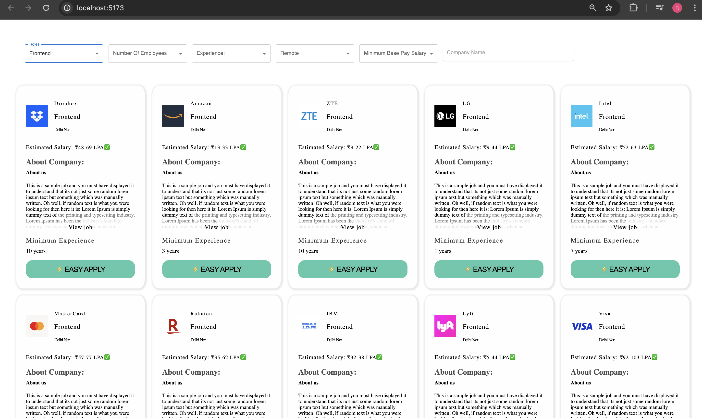

# Weekday App

## Description

Weekday App is a React-based application built on Vite version 4. It fetches data from an external API and displays the data in cards. Users can filter the data using the desired filter options, and the app fetches data accordingly.

## Installation

To install and run the Weekday App locally, follow these steps:

Clone the repository:
git clone https://github.com/rb0298/weekday-app.git
cd weekday-app

Install dependencies:
npm install

# Usage

Run the development server:
npm run dev

Open your browser and navigate to http://localhost:port to view the application.
Enter your desired filter options to fetch and display data in cards.

# Technologies Used

React
Vite version 4
Material UI
Redux
HTML/CSS
JavaScript

# Folder Structure

The folder structure of the Weekday App is as follows:
/public: Contains the HTML file and other public assets.
/src: Contains the React components, application logic, and API handling.
/src/filters: Contains components for filtering data.
/src/cards: Contains components for displaying data in cards.

# Configuration

No special configuration is required to run the Weekday App.

# Development

To run the application in development mode:
npm run dev
